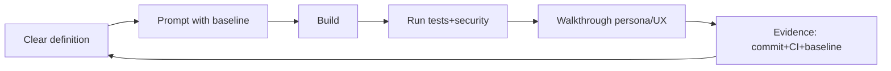

# Table of Contents
- [Ritual (Build → Run → Walkthrough)](#ritual-build--run--walkthrough)
- [Why it replaces endless staging](#why-it-replaces-endless-staging)
- [What to measure](#what-to-measure)
- [Quick view (Mermaid)](#quick-view-mermaid)

# Broad Quality Cycle (50/50)

Half the time is build and half verification. It is the defense against debt and long rollbacks.

## Ritual (Build → Run → Walkthrough)
- **Build:** compile/run locally without heavy staging; feature toggles for Live Alpha.
- **Run:** automated tests + security; liveness `/q/health/live`, readiness `/health/ready` when applicable.
- **Walkthrough:** validate with the persona in mind (does it meet the need?); brief UI/UX check even if visual tools are immature.
- **Evidence:** commit + CI + baseline updated with the lesson (living baseline, no Plan B).

## Why it replaces endless staging
- AI accelerates but also propagates errors; small inconsistent controls create big rollbacks.
- Live Alpha behind flags keeps speed and avoids the abstraction tax.

## What to measure
- % of iterations closed in 1–2h with tests + CI.
- Reduction of rework after applying 50/50.
- Total cycle time (target: 5–10 minutes for a full QA loop).

## Quick view (Mermaid)

