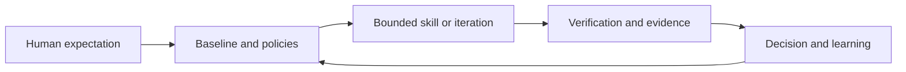

# A-Dev

A-Dev is a vendor-neutral operating framework for model- and agent-assisted software delivery. It turns human expectations into explicit constraints, bounded capabilities, reviewable actions, and evidence-backed learning.

This repository has two distinct products:

1. **The A-Dev practice** defines the doctrine, knowledge, practices, definitions, adoption kit, evidence, and Hardness model used to govern agent-assisted work.
2. **The A-Dev book** explains the practice through narrative chapters, examples, and publishing material.

They support each other, but they are not the same artifact. The practice is normative and reusable. The book is explanatory and editorial.

## Start here

| If you want to... | Go to |
| --- | --- |
| Understand or apply the A-Dev practice | [`framework/README.md`](framework/README.md) |
| Define predictable, policy-conformant agent behavior | [`framework/hardness/README.md`](framework/hardness/README.md) |
| Adopt A-Dev in a repository | [`starter-kit/README.md`](starter-kit/README.md) |
| Review operational proof and case studies | [`docs/evidence-index.md`](docs/evidence-index.md) |
| Read or build the book | [`book/README.md`](book/README.md) |
| Prepare the book for publication | [`publishing-kit/00-inventory.md`](publishing-kit/00-inventory.md) |
| Read the repository operating doctrine used by contributors and agents | [`ADEV.md`](ADEV.md) |

## Repository architecture

```text
framework/           Practice map and normative Hardness foundation
  doctrine/          Governing principles and non-negotiables
  knowledge/         Explanations and accumulated reusable knowledge
  practices/         Repeatable operating patterns and rituals
  definitions/       Shared vocabulary and conceptual boundaries
  kit/               Adoption assets and reusable templates
  evidence/          Proof that supports framework claims
  hardness/          Agent expectations, policies, precedence, and skills

book/                Canonical entry point for the explanatory book
adevelopment-book/   Current book sources and collateral (compatibility path)
manuscript/          Historical manuscript snapshot pending consolidation
starter-kit/         Copyable A-Dev adoption assets
docs/                Documentation site pages and case studies
publishing-kit/      Editorial proposal, readiness, rights, and planning
blog/                Public articles derived from the framework
```

The directories under `framework/` are the conceptual shelves for the practice. During this first reorganization phase, their indexes route to existing canonical assets rather than duplicating or destructively moving content. The book build continues to use `adevelopment-book/` until its two manuscript trees are consolidated in a dedicated change.

## The A-Dev loop



A-Dev does not promise that agents never fail. It makes intended behavior explicit, limits the effect of failure, and turns validated lessons into maintainable rules, skills, tests, or evidence.

## Current status

The delivery practice, starter kit, case studies, and short book already exist. Hardness is an early framework extension: its definition, minimum policy model, and skill contract are now present, while behavioral evaluations, risk profiles, and broader external evidence remain future work.

Canonical committed content is English. Project-specific material such as Homedir is evidence and a proving ground, not universal doctrine.

## Public artifacts

- [Latest book PDF](https://github.com/scanalesespinoza/adev/releases/latest/download/adev-book.pdf)
- [Documentation site](https://scanalesespinoza.github.io/adev/)
- [Apache 2.0 license](LICENSE)
