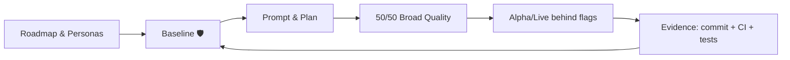

# Augmented Development (A-Dev)

**Hook:** Stop fighting the AI code flood. A-Dev is the framework for the Architect-Orchestrator to govern systems they may not fully understand—but can fully validate—by killing the coordination tax with baseline guardrails, flags, and the 50/50 quality rule.

Augmented Development shows how one experienced person, operating with clear rules, can orchestrate AI to deliver professional software in short cycles with evidence and quality. This repository bundles a short book and a reusable collateral kit for talks, posts, and video series.

## Quick summary
- What it is: a practical guide to run AI with discipline (50/50 quality, living baseline, simple machines) and ship real evidence, not demos.
- For whom: devs/architects who need to move features in hours without big-tech budgets or technical debt.
- How to use: apply the plan → prompt → commit/tests flow behind flags (Live Alpha) and use the baseline to capture every failure as a new rule.

## Contents
- [Philosophy](#philosophy)
- [Repository structure](#repository-structure)
- [Proof & downloads](#proof--downloads)
- [A-Dev flow (mermaid)](#a-dev-flow-mermaid)
- [Join the rampage](#join-the-rampage)

## Philosophy
A-Dev is born from the urgency to be ultra-efficient with limited resources. The “Frugal Architect” turns scarcity into precision: ⚡ initial rampage with AI + simple machines, 🛡️ living baseline that blocks debt, and 🌱 a steady state that is stable and cheap. We don’t use AI to write more code; we use it to validate the human vision better.

2026 demands discipline in the face of the AI-driven debt crisis: less “simulation,” more production evidence with full traceability (plan → prompt → commit/tests).

## Repository structure
Everything lives in `adevelopment-book/`, organized as a compact book and ready-to-use resources:
- `book/`: chapters and appendices.
- `collateral/`: material for one-pagers, talks, videos, and posts.
- `docs/case-studies/`: examples (OAuth, rollback, feature flags, EvenFlow → HomeDir).
- `starter-kit/`: baseline + decision log + quality checklist (ready to start).
See `adevelopment-book/README.md` for a guided tour.

## Proof & downloads
- Latest PDF: https://github.com/scanalesespinoza/adev/releases/latest/download/adev-book.pdf
- Pitch: `publishing-kit/03-one-page-pitch.md`
- Starter kit: `starter-kit/` (baseline, decision log, 50/50 checklist)
- Case studies: `docs/case-studies/` (OAuth, rollback, flags, EvenFlow → HomeDir)
- 10-minute checklist: `adevelopment-book/book/appendices/C-checklists.md` (Starter kit in 10 minutes)

## A-Dev flow (mermaid)

## Join the rampage
- ⚡ Start with a small feature and apply 50/50 (build/run/walkthrough).
- 🛡️ Update the baseline with every failure (living baseline, no Plan B).
- 🌱 Publish evidence: commits, CI, health checks, and badges as proof of quality.
