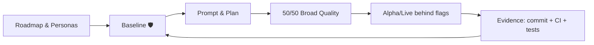

# Augmented Development (A-Dev)

**Hook:** Stop fighting the AI code flood. A-Dev is the framework for the Architect-Orchestrator to govern systems they may not fully understand—but can fully validate—by killing the coordination tax with baseline guardrails, flags, and the 50/50 quality rule.

Augmented Development shows how one experienced person, operating with clear rules, can orchestrate AI to deliver professional software in short cycles with evidence and quality. This repository bundles a short book and a reusable collateral kit for talks, posts, and video series.

## Resumen rápido (ES)
- Qué es: una guía práctica para operar IA con disciplina (50/50 calidad, baseline vivo, máquinas simples) y entregar evidencia real, no demos.
- Para quién: devs/arquitectos que necesitan mover features en horas, sin presupuesto de big tech y sin aceptar deuda técnica.
- Cómo se usa: aplica el flujo plan → prompt → commit/tests detrás de flags (Live Alpha) y usa el baseline para capturar cada fallo en reglas nuevas.

## Contents
- [Philosophy](#philosophy)
- [Repository structure](#repository-structure)
- [Proof & downloads](#proof--downloads)
- [A-Dev flow (mermaid)](#a-dev-flow-mermaid)
- [Join the rampage](#join-the-rampage)

## Philosophy
A-Dev nace de la urgencia de ser ultra-eficiente con recursos limitados. El “Arquitecto Frugal” convierte la escasez en precisión: ⚡ rampage inicial con IA + máquinas simples, 🛡️ baseline viva que evita deuda, y 🌱 steady state barato y estable. No usamos IA para escribir más código; la usamos para validar mejor la visión humana.

2026 nos exige disciplina frente a la crisis de deuda técnica: menos “simulación”, más evidencia en producción con trazabilidad completa (plan → prompt → commit/tests).

## Repository structure
Todo vive en `adevelopment-book/`, organizado como un libro compacto y recursos listos para usar:
- `book/`: capítulos y apéndices.
- `collateral/`: material para one-pagers, charlas, videos y posts.
- `docs/case-studies/`: ejemplos (OAuth, rollback, feature flags, EvenFlow → HomeDir).
- `starter-kit/`: baseline + decision log + calidad (lista para descargar y empezar).
Consulta `adevelopment-book/README.md` para un recorrido guiado.

## Proof & downloads
- PDF última release: https://github.com/scanalesespinoza/adev/releases/latest/download/adev-book.pdf
- Pitch en español: `publishing-kit/03-one-page-pitch-es.md`
- Starter kit: `starter-kit/` (baseline, decision log, 50/50 checklist)
- Casos prácticos: `docs/case-studies/` (OAuth, rollback, flags, EvenFlow → HomeDir)
- Checklist 10 minutos: `adevelopment-book/book/appendices/C-checklists.md` (Starter kit in 10 minutes)

## A-Dev flow (mermaid)

## Join the rampage
- ⚡ Arranca con una feature pequeña y aplica el 50/50 (build/run/walkthrough).
- 🛡️ Actualiza el baseline con cada fallo (living baseline, sin Plan B).
- 🌱 Publica evidencia: commits, CI, health checks y badges como prueba de calidad.
