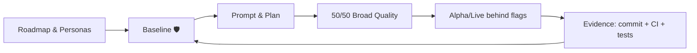

# Augmented Development (A-Dev)

**Hook:** A-Dev is a vendor-neutral framework for AI-assisted delivery. It helps practitioners govern AI work with baselines, small iterations, and evidence so quality does not depend on a specific tool or model.

Augmented Development shows how one practitioner or team, operating with clear rules, can orchestrate interchangeable AI assistants to deliver professional software in short cycles with evidence and quality. This repository bundles a short book and a reusable collateral kit for talks, posts, and workshops.

## Quick summary
- What it is: a practical guide to run AI-assisted delivery with discipline, evidence, and reviewable loops.
- For whom: practitioners, maintainers, architects, and teams that need to move features without tool lock-in or avoidable debt.
- How to use: apply the plan → prompt → implementation → tests → commit flow behind controlled guardrails and use the baseline to capture every failure as a new rule.

## Resumen en Español
**Augmented Development (A-Dev)** es un marco de trabajo agnóstico al proveedor para que practicantes, mantenedores y equipos gobiernen el trabajo asistido por IA. No se trata de escribir más rápido, sino de orquestar con disciplina: reglas de línea base (Baseline), ciclos cortos de calidad y trazabilidad total. Permite entregar software con evidencia sin depender de una herramienta o modelo específico.
- **Lo que es**: Guía práctica para usar IA con evidencia real (commits, tests).
- **Para quién**: Practicantes y equipos que necesitan mover funciones en horas, no semanas.
- **Cómo**: Plan → Prompt → Implementación → Evidencia.

## Contents
- [Philosophy](#philosophy)
- [Repository structure](#repository-structure)
- [Proof & downloads](#proof--downloads)
- [A-Dev flow (mermaid)](#a-dev-flow-mermaid)
- [Next steps](#next-steps)

## Philosophy
A-Dev is born from the need to be precise with limited resources. The method turns scarcity into discipline: fast iteration, a living baseline that blocks avoidable debt, and a steady state that is stable and affordable. We do not use AI to write more code; we use it to validate human intent better.

The current AI wave rewards the teams that can preserve quality, traceability, and portability across tools and delivery contexts.

## Repository structure
Everything lives in `adevelopment-book/`, organized as a compact book and ready-to-use resources:
- `book/`: chapters and appendices.
- `collateral/`: material for one-pagers, talks, videos, and posts.
- `docs/case-studies/`: examples (OAuth, rollback, feature flags, EvenFlow → HomeDir).
- `starter-kit/`: baseline + decision log + quality checklist (ready to start).
See `adevelopment-book/README.md` for a guided tour.

## Proof & downloads
- Latest PDF: https://github.com/scanalesespinoza/adev/releases/latest/download/adev-book.pdf
- Pitch: `publishing-kit/03-one-page-pitch.md`
- Starter kit: `starter-kit/` (baseline, decision log, 50/50 checklist)
- Case studies: `docs/case-studies/` (OAuth, rollback, flags, EvenFlow → HomeDir)
- 10-minute checklist: `adevelopment-book/book/appendices/C-checklists.md` (Starter kit in 10 minutes)

## A-Dev flow (mermaid)

## Next steps
- Start with a small feature and apply disciplined create/verify loops.
- Update the baseline with every failure so the next iteration is portable and repeatable.
- Publish evidence: commits, CI, checks, and review notes as proof of quality.
